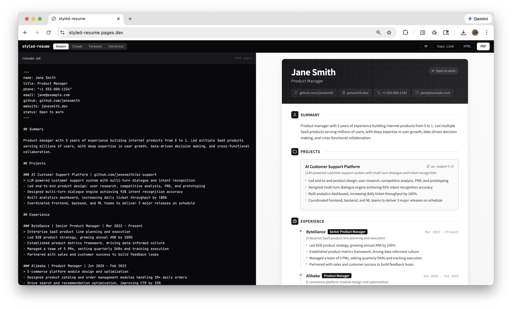
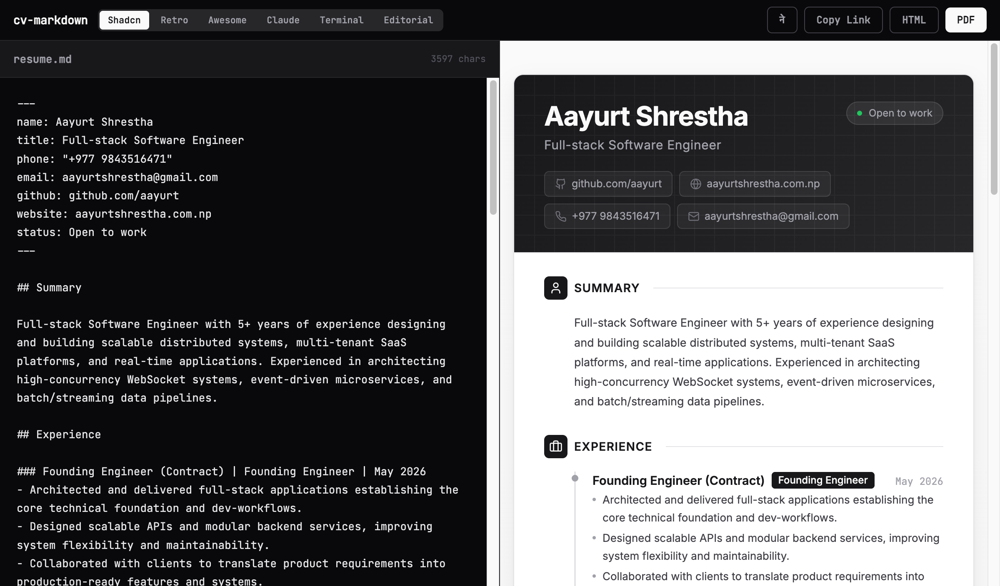
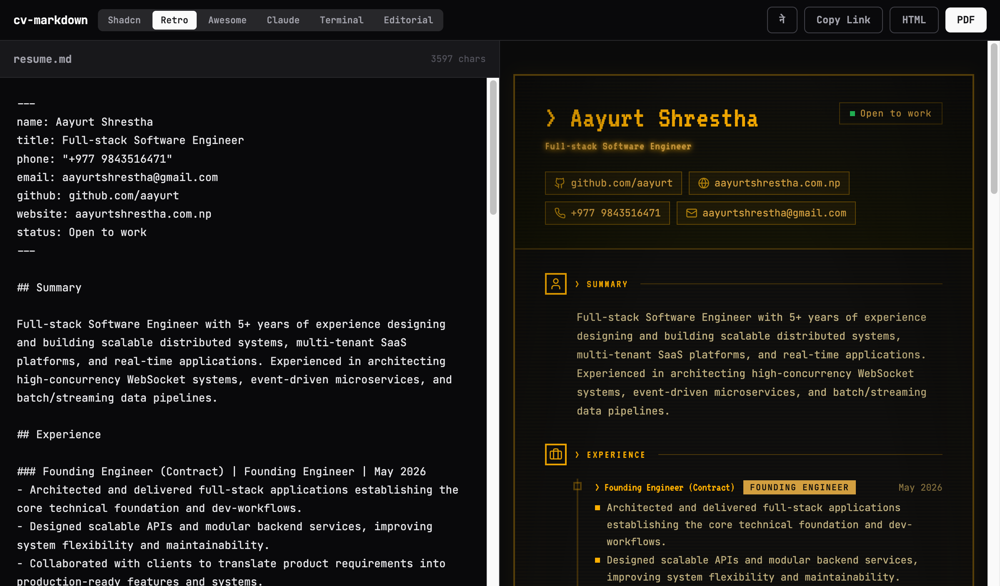
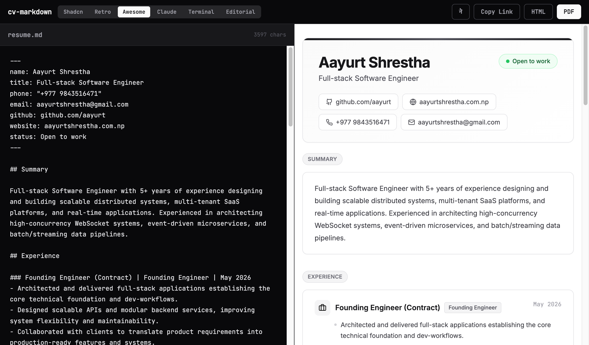
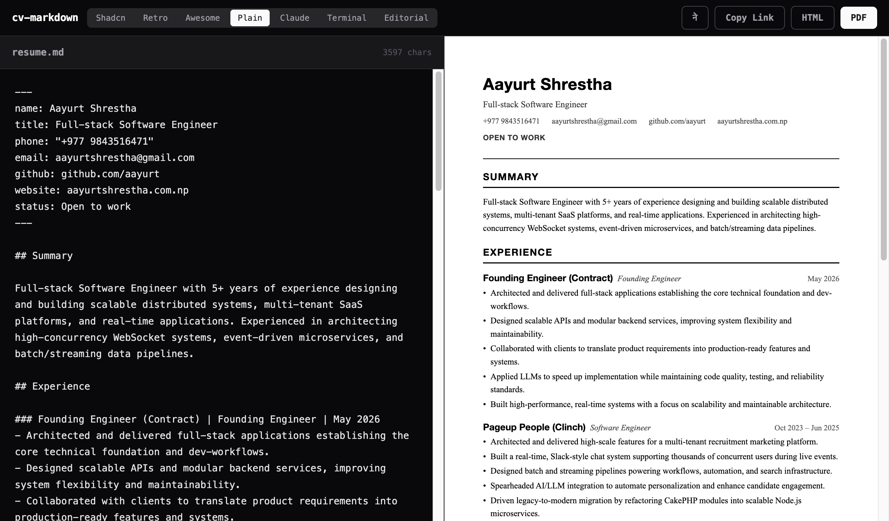
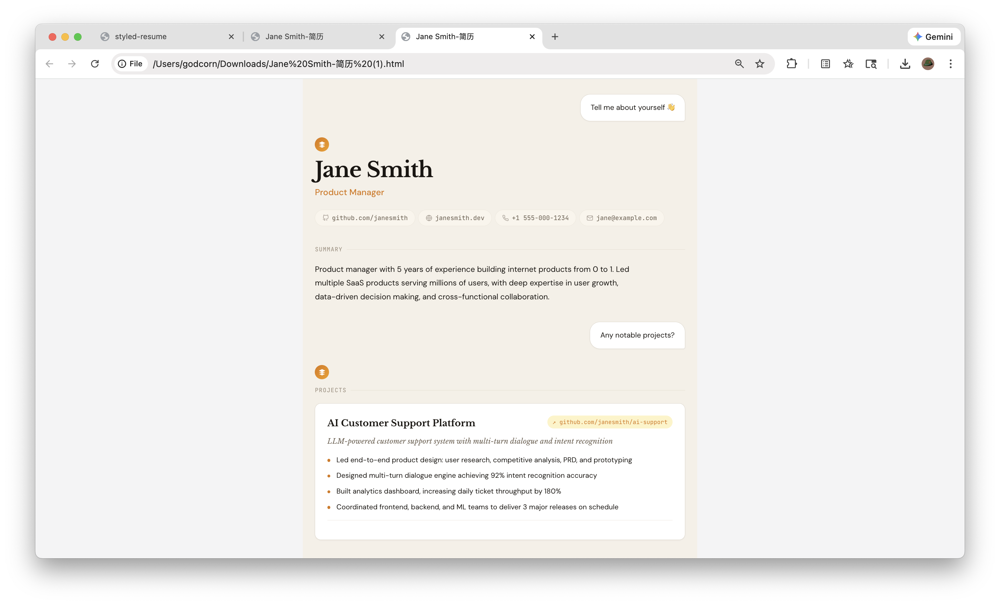
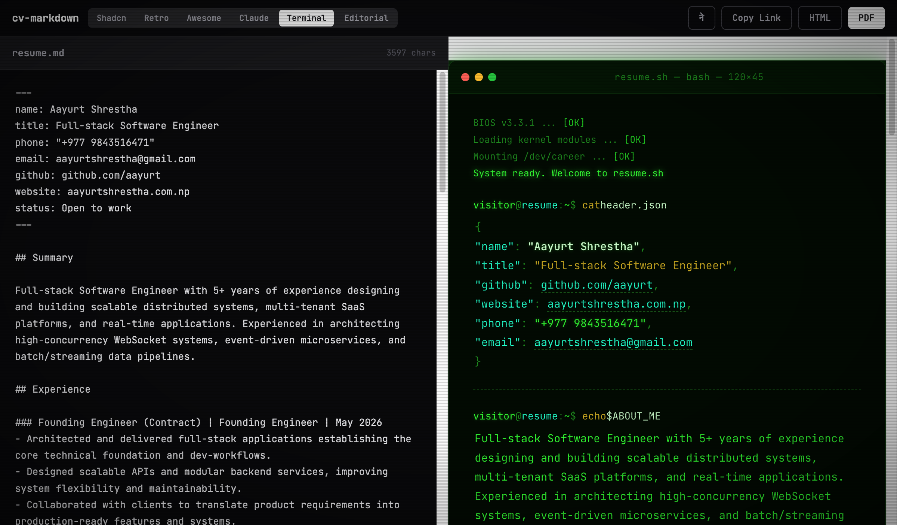
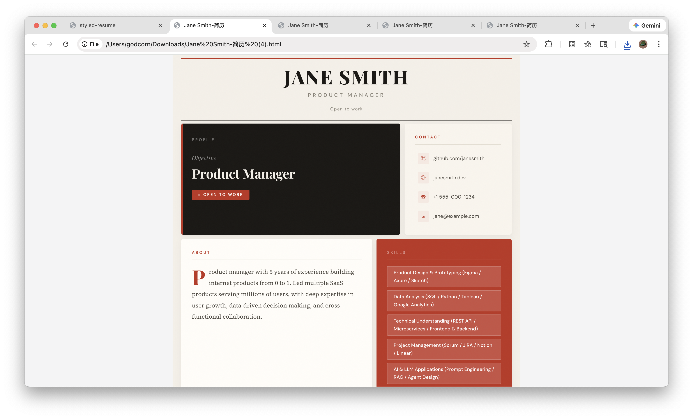

# cv-markdown

[](https://react.dev)
[](https://www.typescriptlang.org)

Write in Markdown. Get a beautifully designed resume.

**Live demo → [styled-resume.vercel.app](https://styled-resume.vercel.app/)**

### Preview



| Shadcn | Retro | Awesome | Plain | Claude | Terminal | Editorial |
|--------|-------|---------|-------|--------|----------|-----------|
|  |  |  |  |  |  |  |
| Clean & minimal | CRT amber terminal | Curated showcase | Print-friendly PDF | Warm & professional | Retro hacker | Newspaper editorial |

### What is this?

Most markdown resume tools produce the same plain output. cv-markdown is different — it turns your markdown into resumes that actually look designed.

One markdown file, seven distinct visual styles. Switch templates instantly, export as PDF or HTML, or share a link that renders your resume in the browser.

### Features

- **7 Designed Templates** — Shadcn (clean), Retro (CRT terminal), Awesome (curated showcase), Plain (print-friendly), Claude (warm), Terminal (retro hacker), Editorial (newspaper bento grid)
- **Live Preview** — Edit markdown on the left, see the result on the right, instantly
- **PDF Export** — Single-page continuous PDF via browser print, no server needed
- **HTML Export** — Download a self-contained HTML file, deploy anywhere
- **Share Link** — Generate a compressed URL, anyone can view your resume in the browser
- **Auto Save** — Your work is saved to localStorage automatically
- **i18n** — Auto-detects browser language, manual toggle between languages

### Quick Start

```bash
git clone git@github.com:aayurt/cv-markdown.git
cd cv-markdown
npm install
npm run dev
```

Open `http://localhost:5174` and start editing.

### How It Works

```
Markdown  →  Parser  →  Template  →  PDF / HTML / Share Link
                           ↑
                     7 visual styles
```

Write your resume in markdown following a simple structure (name, title, experience, projects, skills, etc.). The parser converts it to structured data, and the template engine renders it with the style you choose.

### Markdown Structure

```
---
name: Your Name
title: Your Job Title
phone: "+977 1234567890"
email: you@email.com
github: github.com/you
website: yoursite.com
status: Open to work
---

## Summary

A short paragraph about yourself.

## Experience

### Company Name | Your Position | Start – End
> Brief overview of your role (optional)

- Bullet point describing an achievement
- Another bullet point
`Tag1` `Tag2` `Tag3`

## Projects

### Project Name | github.com/you/repo
> Overview (optional)

- Did X which resulted in Y
`React` `Node.js`

## Education

### University Name | Degree | Major | Period

## Skills

- Skill One
- Skill Two

## Appendix

### Certification Name

Description text here.


```

**Field rules:**
- **Frontmatter** (between `---`) — fields: `name`, `title`, `phone`, `email`, `github`, `website`, `status`
- **Sections** — use `## Section Name` (accepted: Summary, Experience, Projects, Education, Skills, Appendix)
- **Entries** — use `### Name | Field2 | Field3 | Field4` with `|` separators
- **Bullets** — lines starting with `- `
- **Overview/context** — lines starting with `> `
- **Tech tags** — backtick-wrapped like `` `React` ``
- **Images** — markdown format: ``

### Agent Prompt

Give this prompt to any AI agent (Gemini, Claude, ChatGPT, etc.) to generate resume markdown in the correct format:

````
Generate a resume in the EXACT markdown format shown below. Replace the example content with the user's real information.

RULES:
- Frontmatter between --- lines: name, title, phone, email, github, website, status
- Sections start with ## (accepted: Summary, Experience, Projects, Education, Skills, Appendix)
- Entries within sections start with ###, fields separated by |
- Bullet points start with "- "
- Overview/context lines start with "> "
- Tech tags in backticks like `React` `TypeScript`
- Images use markdown: 

FORMAT (keep this exact structure):
```
---
name: Jane Doe
title: Senior Software Engineer
phone: "+1 555 123 4567"
email: jane@example.com
github: github.com/janedoe
website: janedoe.com
status: Open to work
---

## Summary

Full-stack engineer with 6+ years building scalable web applications, distributed systems, and developer tools. Passionate about clean architecture and developer experience.

## Experience

### Acme Corp | Senior Software Engineer | Jan 2022 – Present
> Led the platform team building real-time infrastructure

- Designed and deployed a WebSocket-based notification system handling 50k+ concurrent connections
- Migrated legacy monolith to microservices, reducing deployment time by 80%
- Mentored 4 junior engineers through structured code review and pair programming

`React` `Node.js` `TypeScript` `WebSockets` `Redis`

### Beta Inc | Software Engineer | Mar 2019 – Dec 2021
- Built RESTful APIs serving 1M+ daily requests with 99.9% uptime
- Implemented CI/CD pipeline reducing release cycle from 2 weeks to daily

`Python` `Django` `PostgreSQL` `Docker`

## Projects

### Payload CMS Starter | github.com/janedoe/payload-starter
> A production-ready starter template for Payload CMS

- Built authentication, RBAC, and multi-tenant support out of the box
- 500+ GitHub stars and used by 3 production applications

`TypeScript` `Payload CMS` `React`

## Education

### MIT | MSc | Computer Science | 2017 – 2019
### UC Berkeley | BSc | Electrical Engineering | 2013 – 2017

## Skills

- TypeScript / JavaScript
- React, Next.js
- Node.js, Python
- PostgreSQL, Redis
- Docker, AWS
- System Design

## Appendix

### AWS Solutions Architect Certification

Professional level certification covering distributed system design on AWS.


```

Generate ONLY the markdown block above — no introductory text, no explanation, no commentary. Replace the example content with the user's actual information.
````

### Tech Stack

React · Vite · TypeScript · Tailwind CSS · lz-string
